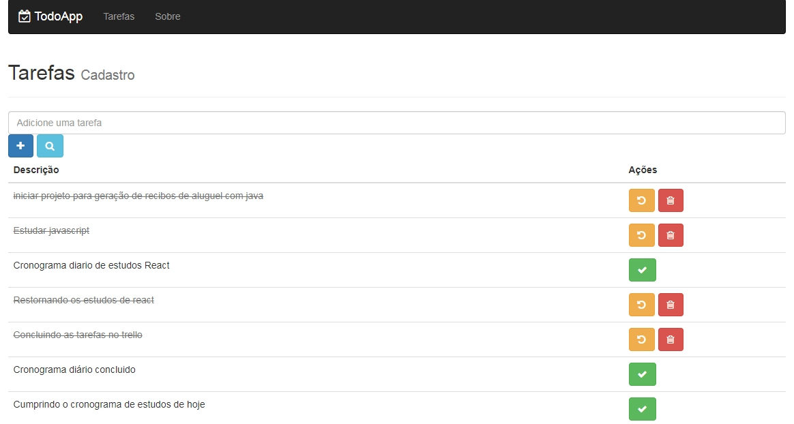

## Todo-App React com NodeJS
Projeto desenvolvido durante o curso de React   

## Instalando as Dependências  do backend
- `yarn install`
- iniciar backend em modo de produção: `yarn production Todo-App`

## Instalando as Dependências do frontend
- `yarn install`
- iniciar o react: `yarn dev` (Ambiente de desenvolvimento - provisório)

## Autor
William José Dias [Git](https://github.com/WilliamWJD)